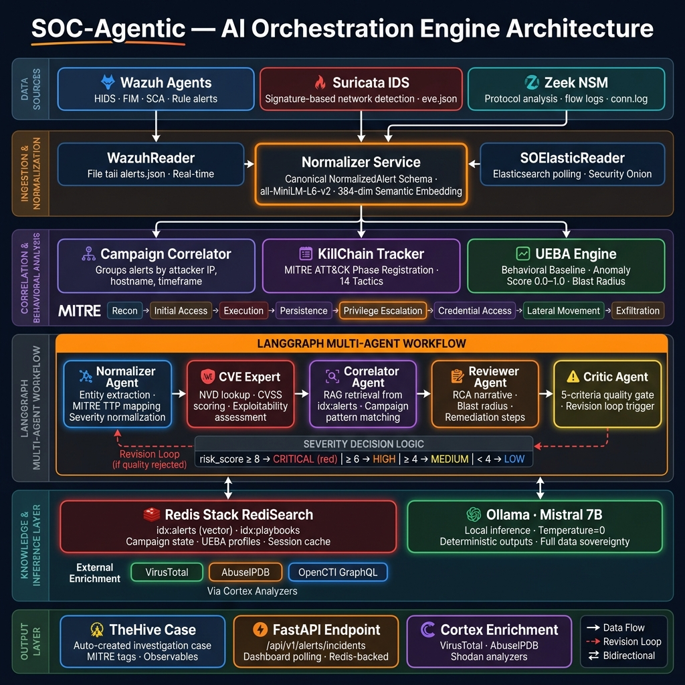
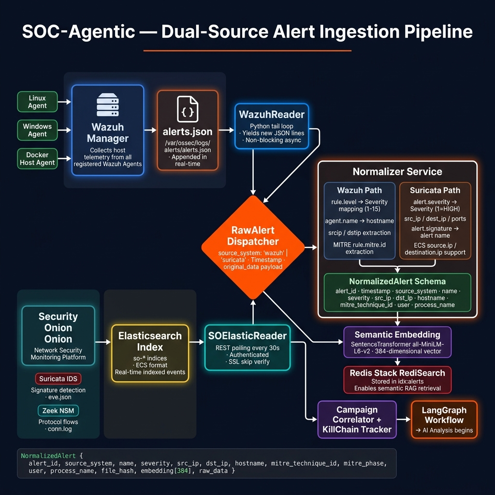
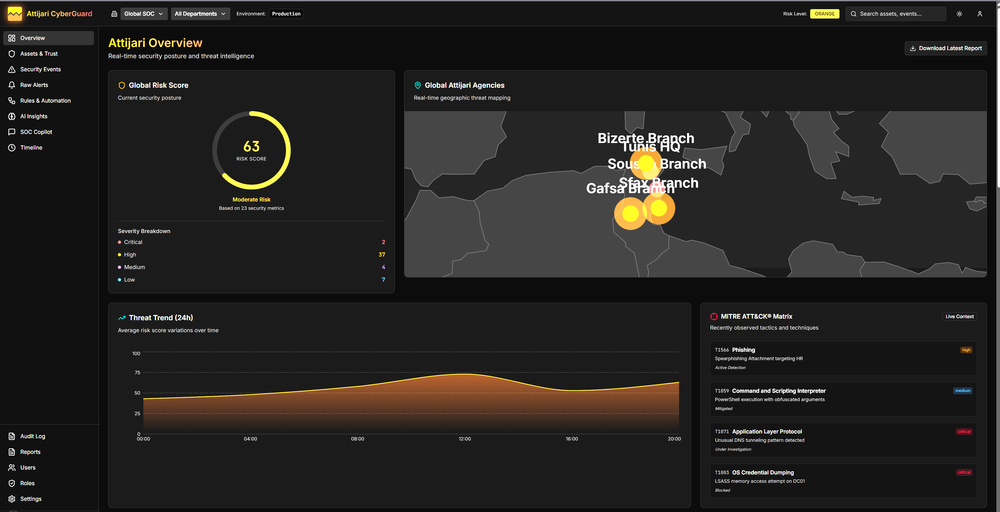
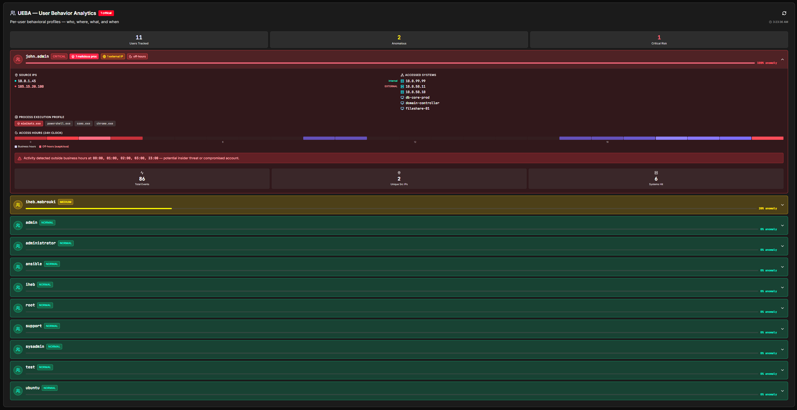

# AI-Driven SOC Platform

An end-to-end Security Operations Center that combines a classic SIEM / threat-intelligence stack with a **local, air-gapped LLM analysis engine**. Alerts flow from Wazuh, Suricata and Security Onion into a LangGraph multi-agent pipeline that triages, enriches, correlates and explains them — then opens cases in TheHive and renders everything in a React dashboard.

Built as a final-year engineering project (PFE) deployed in a banking environment, where data sovereignty was a hard requirement: **all AI inference runs locally on Ollama/Mistral — no data ever leaves the infrastructure.**



## Highlights

- **Multi-agent AI triage (LangGraph)** — autonomous L1/L2 alert handling modelled on real SOC analyst workflows: normalization, enrichment, MITRE ATT&CK mapping, root-cause analysis and response proposals.
- **RAG-powered forensics** — natural-language search over archived logs and threat-intel documents during live investigations.
- **Prompt-injection defence** — a dedicated multi-agent guard in front of the LLM engine, protecting it from adversarial input embedded in log data.
- **Air-gapped local LLM** — Ollama + Mistral on GPU; zero external API calls.
- **Full SOC toolstack** — Wazuh (SIEM/EDR), Suricata IDS, Security Onion, TheHive + Cortex case management, OpenCTI + MISP threat intel, ModSecurity WAF, WireGuard VPN.
- **UEBA & insider-threat detection** — behavioural baselines with anomaly scoring and separated learning/detection phases.
- **Kill-chain & campaign correlation** — alerts grouped into attack campaigns with reconstructed timelines.
- **Two deployment modes** — Docker Compose (per tier) or Kubernetes ([`k8s/`](k8s/), 53 resources, one-command deploy).

## Architecture

The platform is organised in tiers, each independently deployable:

| Tier | Directory | Components |
|------|-----------|------------|
| **Tier 1 — Detection** | [`soc-tier1/`](soc-tier1/) | Wazuh manager / indexer / dashboard, ModSecurity WAF, WireGuard VPN, Filebeat |
| **Tier 2 — Intel & cases** | [`soc-tier2/`](soc-tier2/) | TheHive (+ Cassandra, Elasticsearch), Cortex analyzers, OpenCTI (+ workers, MITRE & TheHive connectors) |
| **AI Engine** | [`soc-ai/`](soc-ai/) | FastAPI service, LangGraph multi-agent pipeline, Celery workers, Redis, Ollama (Mistral, GPU) |
| **Dashboard** | [`security-intelligence-platform/`](security-intelligence-platform/) | Next.js 16 / React 19 frontend: overview, security events, MITRE view, UEBA, copilot chat, reporting |
| **Backend API** | [`security-intelligence-platform-backend/`](security-intelligence-platform-backend/) | Flask REST API, PostgreSQL, RBAC & audit logging — setup guide in [`docs/web-platform.md`](docs/web-platform.md) |
| **Kubernetes** | [`k8s/`](k8s/) | Manifests for the whole platform (StatefulSets, GPU scheduling, Ingress, HPA) — see [`k8s/README.md`](k8s/README.md) |
| **Victim lab** | [`victim-lab/`](victim-lab/) | Containerized target used for attack simulations |



## Screenshots

| Overview | AI Insight |
|---|---|
|  |  |

| MITRE ATT&CK mapping | UEBA |
|---|---|
|  |  |

More in [`screenshots/`](screenshots/).

## Quick start (Docker Compose)

Each tier has its own compose file. Bring them up in order:

```bash
# 0. configure secrets — never commit .env files
cp .env.example .env                  # web platform (Postgres)
cp soc-ai/.env.example soc-ai/.env    # AI engine (Wazuh/OpenCTI/Cortex credentials)
cp soc-tier1/.env.example soc-tier1/.env

# 1. detection tier (Wazuh, WAF, VPN)
docker compose -f soc-tier1/docker-compose.yml up -d

# 2. intel tier (TheHive, Cortex, OpenCTI)
docker compose -f soc-tier2/docker-compose.yml up -d

# 3. AI engine (FastAPI + Celery + Redis + Ollama)
docker compose -f soc-ai/docker-compose.yml up -d
docker exec ollama ollama pull mistral:latest

# 4. web platform (dashboard backend + Postgres + Nginx)
docker compose up -d
cd security-intelligence-platform && npm install && npm run dev
```

GPU inference requires the NVIDIA container runtime (tested on an RTX 4070 SUPER, 12 GB).

## Quick start (Kubernetes)

```bash
kubectl apply -k k8s/
kubectl -n soc get pods
```

See [`k8s/README.md`](k8s/README.md) for prerequisites (StorageClass, ingress controller, NVIDIA device plugin) and a Compose → Kubernetes mapping.

## Attack simulation & demos

The repo ships with reproducible attack scenarios used to exercise the full pipeline end-to-end (attack → detection → AI triage → case → report):

- `demo_apt29_attack.py` — multi-stage APT emulation mapped to MITRE techniques
- `demo_ueba_attack.py` — insider-threat scenario against the UEBA baselines
- `soc-ai/simulate_bruteforce.py`, `simulate_escalation.py`, … — targeted single-scenario injects
- [`victim-lab/`](victim-lab/) — the containerized victim endpoint

## Security notes

- **No secrets in the repo.** All credentials come from environment variables / `.env` files (gitignored). Start from the provided `.env.example` files.
- TLS certificates, private keys and VPN configuration are generated locally and are **not** tracked.
- The Kubernetes `Secret` manifest ships placeholder values only; create real secrets at deploy time (`kubectl create secret ...`).
- This is a lab/PFE platform. Before any production use: rotate every credential, enable TLS verification where disabled, and review WAF/ingress exposure.

## Tech stack

**Security:** Wazuh · Suricata · Security Onion · TheHive · Cortex · OpenCTI · MISP · ModSecurity · WireGuard
**AI:** LangGraph · LangChain · RAG · Ollama (Mistral) · custom prompt-injection defence
**Platform:** FastAPI · Celery · Redis · Flask · PostgreSQL · Next.js 16 · React 19 · Tailwind 4
**Infra:** Docker Compose · Kubernetes · Nginx · GPU inference (NVIDIA)

## Author

**Iheb Mabrouki** — Cybersecurity Engineer
[LinkedIn](https://www.linkedin.com/in/iheb-mabrouki-cs) · [GitHub](https://github.com/ihebmabroukii) · ihebmabrouki2702@gmail.com

## License

See [LICENSE](LICENSE).
